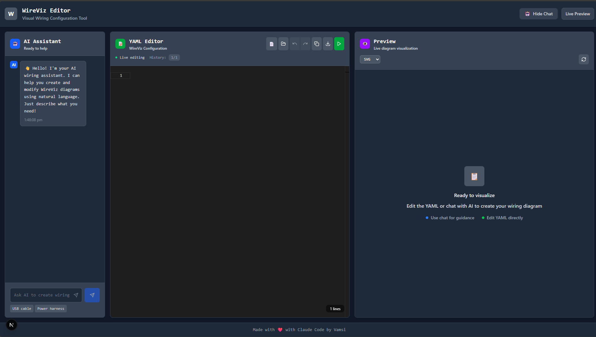
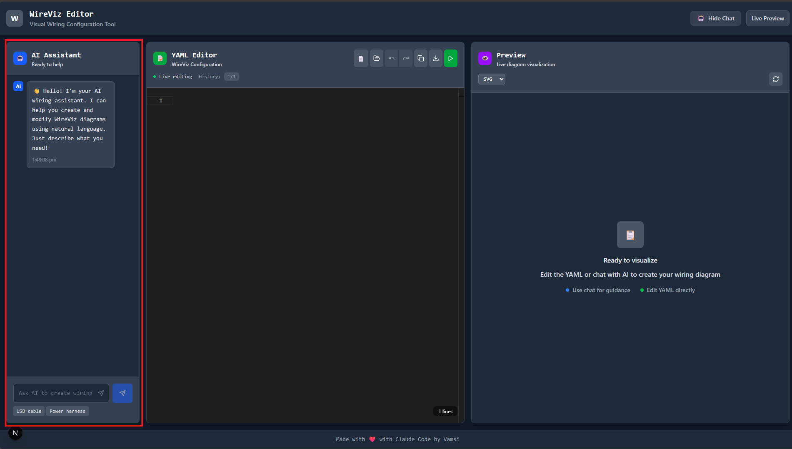
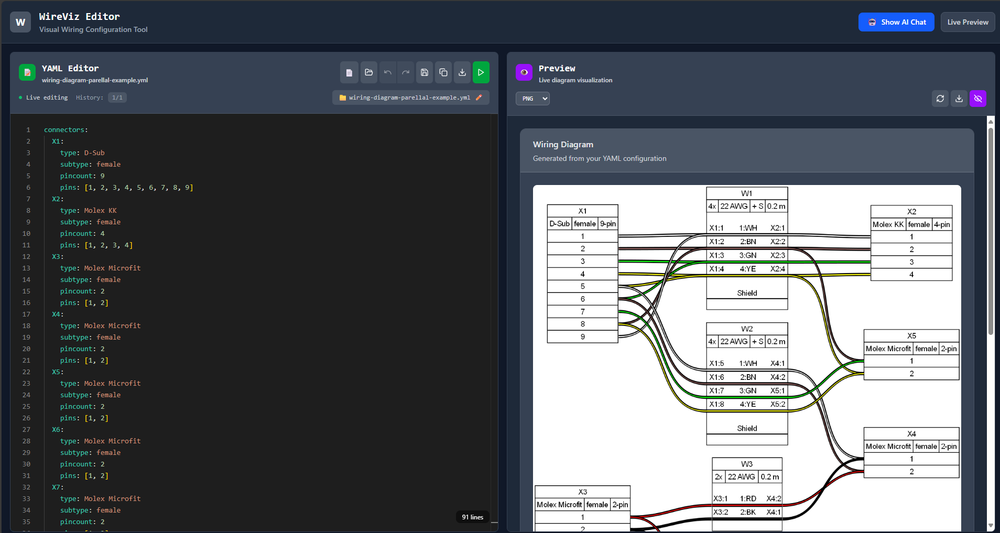
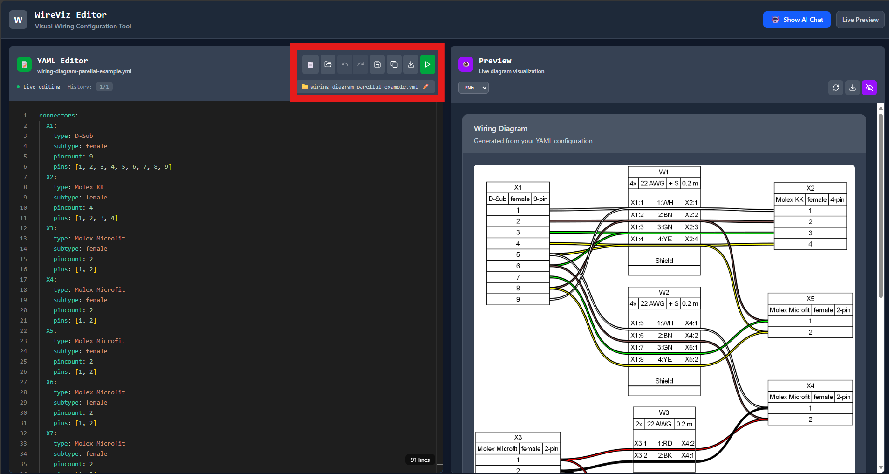

# WireViz Editor

An AI-powered web application for creating and editing wiring diagrams using WireViz. Features a real-time YAML editor, live diagram preview, and intelligent AI chat assistant for natural language diagram creation.



## ✨ Features

- 🎨 **Modern Web Interface**: Clean, developer-friendly dark theme
- 📝 **Live YAML Editor**: Syntax-highlighted editor with real-time validation
- 👁️ **Instant Preview**: Live diagram generation with multiple output formats (SVG, PNG, HTML)
- 🤖 **AI Assistant**: Natural language to YAML conversion using OpenAI or Anthropic
- 📊 **Bill of Materials**: Auto-generated BOM with formatted tables
- 💾 **File Management**: Open, save, rename YAML files with modification tracking
- 🔄 **Undo/Redo**: 10-level undo/redo with keyboard shortcuts (Ctrl+Z/Ctrl+Y)
- 🔄 **Collapsible Layout**: Maximize editor/preview space when needed
- ⚡ **Quick Save**: One-click save for opened files
- 📱 **Responsive Design**: Works on desktop and mobile devices

## 🖼️ Screenshots

### Main Interface

*The main application showing the YAML editor, AI chat, and diagram preview*

### AI Chat Assistant

*AI-powered chat for creating diagrams with natural language*

### Live Preview

*Real-time diagram generation with multiple output formats*

### File Management

*File operations with modification tracking and quick save*

## 🚀 Quick Start

### Prerequisites

- **Python 3.8+** (for backend)
- **Node.js 16+** (for frontend)
- **WireViz** installed on your system
- **API Key** from OpenAI or Anthropic

### Installation

1. **Clone the repository**
   ```bash
   git clone https://github.com/yourusername/wireviz-editor.git
   cd wireviz-editor
   ```

2. **Set up the backend**
   ```bash
   cd backend
   python -m venv venv
   source venv/bin/activate  # On Windows: venv\Scripts\activate
   pip install -r requirements.txt
   ```

3. **Configure environment variables**
   ```bash
   cp .env.example .env
   # Edit .env and add your API keys:
   # ANTHROPIC_API_KEY=your_anthropic_key_here
   # OPENAI_API_KEY=your_openai_key_here
   ```

4. **Set up the frontend**
   ```bash
   cd ../frontend
   npm install
   ```

5. **Start the application**
   ```bash
   # Terminal 1: Start backend
   cd backend
   python main.py
   
   # Terminal 2: Start frontend
   cd frontend
   npm run dev
   ```

6. **Open your browser**
   Navigate to `http://localhost:3000`

## 📖 Usage Guide

### Basic Usage

1. **Start Creating**: The YAML editor loads with a default wiring example
2. **Live Preview**: Edit YAML and see diagrams update in real-time
3. **AI Assistance**: Use the chat to create diagrams with natural language
4. **File Operations**: Open existing YAML files or save your work

### YAML Editor

- **Syntax Highlighting**: Full YAML syntax support with WireViz validation
- **Live Editing**: Changes appear instantly in the preview
- **File Management**: New, open, save, rename operations
- **Modification Tracking**: Visual indicators show unsaved changes
- **Quick Save**: One-click save for opened files
- **Undo/Redo**: Full edit history with 10-level undo/redo support
- **Keyboard Shortcuts**: Ctrl+Z (undo), Ctrl+Y (redo), cross-platform compatible


### AI Chat Assistant

The AI chat helps you create wiring diagrams using natural language:

```
User: "Create a USB cable with 4 wires"
AI: I'll create a USB cable configuration for you with 4 wires...
```

**Sample Prompts:**
- "Add a DB9 connector with 9 pins"
- "Create a power cable with ground wire"
- "Connect pin 1 to pin 3"
- "Change the cable gauge to 18 AWG"


### Diagram Preview

- **Multiple Formats**: View diagrams as SVG, PNG, or HTML
- **Download Options**: Save diagrams in any format
- **Bill of Materials**: Auto-generated component lists
- **Responsive Display**: Diagrams scale to fit your screen


## 🛠️ Advanced Features

### File Management

- **Open Files**: Load existing YAML files with full validation
- **Rename Files**: Click filename to edit inline
- **Modification Tracking**: Orange indicators show unsaved changes
- **Quick Save**: Instant save for opened files
- **Edit History**: Complete undo/redo system preserves your work

### Undo/Redo System

- **10-Level History**: Track up to 10 edits in each direction
- **Keyboard Shortcuts**: 
  - **Ctrl+Z** (Cmd+Z on Mac): Undo last change
  - **Ctrl+Y** or **Ctrl+Shift+Z** (Cmd+Y on Mac): Redo change
- **Visual Indicators**: Toolbar buttons show available undo/redo actions
- **History Counter**: See your current position in edit history (e.g., "3/7")
- **Smart Branching**: Making changes after undo creates a new history branch
- **File Integration**: History resets when opening new files or creating new documents

### AI Context Awareness

The AI assistant understands your current diagram and can:
- Modify existing connections
- Add new components to current design
- Suggest improvements
- Explain WireViz syntax

### Collapsible Interface

- **Hide Chat**: Collapse AI chat to maximize editor space
- **Dynamic Layout**: Editor and preview automatically resize
- **Mobile Friendly**: Responsive design works on all devices

## 🎯 WireViz YAML Examples

### Basic USB Cable
```yaml
connectors:
  X1:
    type: USB-A
    subtype: male
    pincount: 4
    pins: [1, 2, 3, 4]
  X2:
    type: USB-B
    subtype: female
    pincount: 4
    pins: [1, 2, 3, 4]

cables:
  W1:
    gauge: 28 AWG
    length: 1.0
    color_code: DIN
    wirecount: 4
    shield: true

connections:
  - 
    - X1: [1, 2, 3, 4]
    - W1: [1, 2, 3, 4]
    - X2: [1, 2, 3, 4]
```

### Power Harness
```yaml
connectors:
  POWER:
    type: Molex KK
    subtype: female
    pincount: 2
    pins: [1, 2]
  DEVICE1:
    type: JST XH
    subtype: male
    pincount: 2
    pins: [1, 2]

cables:
  PWR_CABLE:
    gauge: 22 AWG
    length: 0.5
    wirecount: 2
    colors: [RD, BK]

connections:
  - 
    - POWER: 1
    - PWR_CABLE: 1
    - DEVICE1: 1
  - 
    - POWER: 2
    - PWR_CABLE: 2
    - DEVICE1: 2
```

## 🔧 Development

### Project Structure
```
wireviz-editor/
├── frontend/                 # Next.js React frontend
│   ├── src/
│   │   ├── components/      # React components
│   │   ├── app/            # Next.js app router
│   │   └── styles/         # CSS and styling
│   └── package.json
├── backend/                 # FastAPI Python backend
│   ├── services/           # Business logic
│   ├── models/             # Data models
│   ├── main.py            # FastAPI app
│   └── requirements.txt
├── screenshots/            # README screenshots
└── deploymentPlan.md      # Deployment guide
```

### API Endpoints

- `POST /api/chat` - AI chat interface
- `POST /api/generate-diagram` - Generate WireViz diagrams
- `GET /health` - Health check

### Technology Stack

**Frontend:**
- Next.js 15 with React 18
- TypeScript for type safety
- Tailwind CSS for styling
- Monaco Editor for YAML editing
- Lucide React for icons

**Backend:**
- FastAPI for high-performance API
- OpenAI/Anthropic integration
- WireViz for diagram generation
- Pydantic for data validation

## 🤝 Contributing

1. Fork the repository
2. Create a feature branch (`git checkout -b feature/amazing-feature`)
3. Commit your changes (`git commit -m 'Add amazing feature'`)
4. Push to the branch (`git push origin feature/amazing-feature`)
5. Open a Pull Request

### Development Setup

```bash
# Install dependencies
cd frontend && npm install
cd ../backend && pip install -r requirements.txt

# Start development servers
npm run dev          # Frontend (localhost:3000)
python main.py       # Backend (localhost:8000)
```

## 📄 License

This project is licensed under the MIT License - see the [LICENSE](LICENSE) file for details.

## 🙏 Acknowledgments

- **WireViz** - Amazing tool for generating wiring diagrams
- **OpenAI/Anthropic** - AI language models for natural language processing
- **Next.js** - React framework for the frontend
- **FastAPI** - High-performance Python web framework

## 🔒 Security

### Environment Configuration
- **Never commit API keys**: Use `.env` files (already gitignored)
- **Production deployment**: Set `DEBUG=False` and configure `ALLOWED_ORIGINS`
- **API key security**: Regenerate keys if accidentally exposed

### Best Practices
- Keep your `.env` file secure and never share it
- Use environment-specific configuration for production deployments
- Regularly rotate API keys for enhanced security
- Monitor API usage to detect any unauthorized access

## 📞 Support

- 🐛 **Issues**: Report bugs on GitHub Issues
- 💡 **Feature Requests**: Suggest features on GitHub Discussions
- 📖 **Documentation**: Check the [Wiki](../../wiki) for detailed guides

---

**Built with Claude Code**


